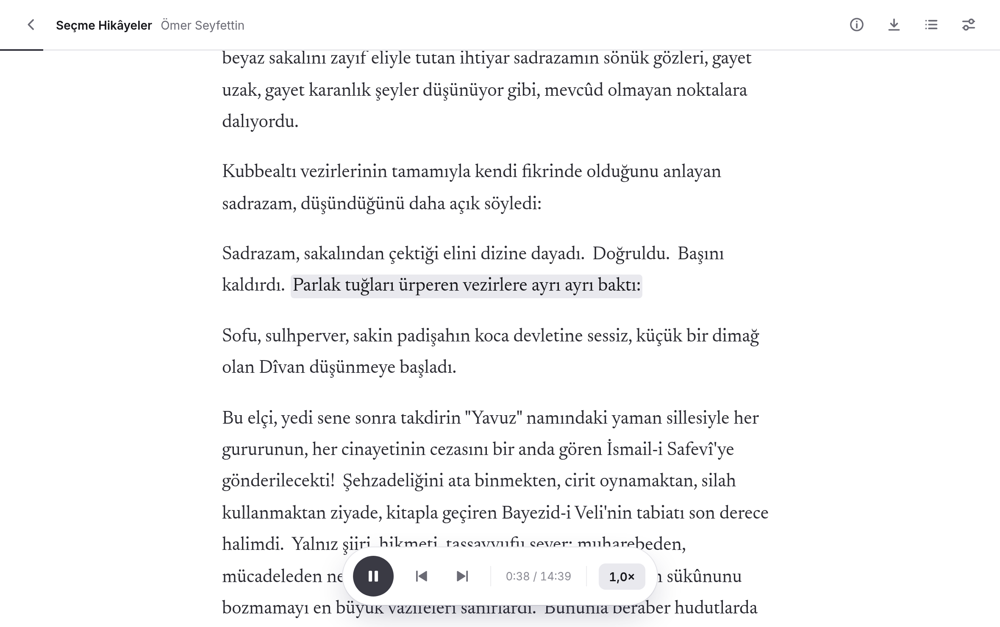

<p align="center"></p>

<h1 align="center">EMA Reader</h1>

<p align="center"><b>Kitaplarını ve makalelerini Türkçe dinle.</b><br>
Bir kitap ekle, oynat düğmesine bas; EMA Reader onu sana kendi bilgisayarında okusun.</p>


## Neler yapar

- **Kitaplarını sesli okur.** Bir EPUB ya da PDF ekle veya bir makalenin adresini yapıştır, sonra dinle.
- **Nerede olduğunu gösterir.** Okunan cümle işaretlenir. Başka bir cümleye tıklarsan oradan devam eder.
- **Kaldığın yeri hatırlar.** Uygulamayı kapatıp yarın açtığında aynı cümleden devam eder.
- **Senin hızında okur.** İstediğin zaman yavaşlat ya da hızlandır.
- **Yanında götürmeni sağlar.** Bir bölümü ya da kitabın tamamını telefonun veya araban için MP3 olarak kaydet.
- **Gizli kalır.** Her şey kendi bilgisayarında olur. Hesap yok, abonelik yok; okudukların hiçbir yere gönderilmez.



## EMA Reader'ı edin

**Windows:** [Sürümler](../../releases) sayfasından `EMA-Reader-Setup.exe` dosyasını indir ve aç. Yönetici parolası gerekmez.

**macOS:** [Sürümler](../../releases) sayfasından `EMA-Reader.dmg` dosyasını indir ve aç, sonra EMA Reader'ı yanındaki Uygulamalar klasörüne sürükle.

Uygulama yeni ve ücretsiz olduğu için Windows ya da macOS ilk açılışta seni uyarabilir. Windows'ta "Ek bilgi"yi, ardından "Yine de çalıştır"ı seç. macOS'te uygulamayı bir kez açmayı dene, sonra Sistem Ayarları'nda "Gizlilik ve Güvenlik"e gidip en alttaki "Yine de Aç"ı seç; macOS 14 ve öncesinde uygulamaya sağ tıklayıp "Aç"ı seçmek de yeter.

İlk açılışta EMA Reader, sesi üretecek parçaları bilgisayarına göre bir kez indirir: NVIDIA ekran kartın varsa onu, Mac'te Apple silicon'un ekran kartını, ikisi de yoksa işlemciyi kullanan sürümü. Hangisinin ineceğini ve ne kadar yer tutacağını indirmeden önce gösterir; sonradan Ayarlar'daki "Seslendirme"den değiştirebilirsin.

**Linux:** [Sürümler](../../releases) sayfasından sistemine uyan paketi indir:

| Sistem | Paket |
|---|---|
| Ubuntu 24.04 ve sonrası, Debian 13 ve onlara dayananlar (Linux Mint 22, Pop!_OS, Zorin OS…) | `EMA-Reader.deb` |
| Fedora 41 ve sonrası | `EMA-Reader.rpm` |
| Arch Linux ve ona dayananlar (Manjaro, EndeavourOS…) | `EMA-Reader.pkg.tar.zst` |

Sonra dosyayı çift tıklayıp yazılım merkeziyle kur ya da uçbirimden kur:

```bash
sudo apt install ./EMA-Reader.deb               # Ubuntu ve Debian
sudo dnf install ./EMA-Reader.rpm               # Fedora
sudo pacman -U ./EMA-Reader.pkg.tar.zst         # Arch Linux
```

Bundan sonra EMA Reader uygulamalar menünde durur. Yeni bir sürüm çıktığında uygulama onu kendisi kurar; yalnızca parolanı sorar.

Başka bir dağıtım kullanıyorsan EMA Reader'ı kaynaktan çalıştırabilirsin. [uv](https://docs.astral.sh/uv/) kur, sonra:

```bash
git clone https://github.com/sudoeren/ema-reader
cd ema-reader
uv run --extra desktop desktop.py --install
```

### Kaldırma

İlk açılışta indirilen parçalar birkaç gigabayt tutabilir. Onları Ayarlar'daki "İndirilenler" satırından kaldırabilirsin; kitaplığın yerinde kalır, uygulama yeniden açıldığında bunları yeniden indirmeyi önerir.

EMA Reader'ı tümüyle kaldırmak için:

- **Windows:** Ayarlar'daki "Uygulamalar"dan EMA Reader'ı kaldır. İndirilen parçalar da onunla birlikte gider.
- **macOS:** önce uygulamadaki Ayarlar'dan indirilenleri kaldır, sonra EMA Reader'ı Çöp Sepeti'ne taşı.
- **Linux:** önce uygulamadaki Ayarlar'dan indirilenleri kaldır, sonra paketi kaldır: `sudo apt remove ema-reader`, `sudo dnf remove ema-reader` ya da `sudo pacman -R ema-reader`.

Kitaplığın hiçbir durumda silinmez; kullanıcı klasöründeki "EMA Reader" veri klasöründe durur.

### En düşük sistem gereksinimleri

| | Windows | macOS | Linux |
|---|---|---|---|
| **Sistem** | Windows 10 ya da 11, 64 bit | Apple silicon'lu (M1 ve sonrası) bir Mac | 64 bit (x86_64); paketler için yukarıdaki sistemlerden biri, kaynaktan çalıştırmak için GTK 4, libadwaita ve WebKitGTK 6.0 kurulu bir masaüstü |
| **Bellek** | 4 GB | 4 GB | 4 GB |
| **Boş disk alanı** | işlemciyle yaklaşık 1 GB, NVIDIA kartıyla yaklaşık 5 GB | yaklaşık 1 GB | işlemciyle yaklaşık 1 GB, NVIDIA kartıyla yaklaşık 6 GB |
| **Ekran kartı** | gerekmez; NVIDIA kart varsa kullanılır | gerekmez; Apple silicon'un ekran kartı kullanılır | gerekmez; NVIDIA kart varsa kullanılır |

- Uygulama çalışırken yaklaşık 1 GB bellek kullanır.
- Ekran kartı olmadan da akıcı okur: bir cümlenin sesi, sıradan bir işlemcide cümlenin kendisinden çok daha kısa sürede hazırlanır. Ekran kartı en çok bir kitabı ses dosyası olarak indirirken fark yaratır.
- NVIDIA kartı kullanmak için güncel bir NVIDIA sürücüsü kurulu olmalıdır. AMD ve Intel ekran kartları şimdilik desteklenmez; onlarda EMA Reader işlemciyi kullanır.
- İnternet ilk açılışta (sesi üretecek parçalar ve ses modeli indirilirken), web'den makale eklerken ve yeni sürüm denetiminde kullanılır. Dinlemek için internet gerekmez.

## İlk dakikan

EMA Reader'ı ilk açtığında sana etrafı gezdirir. Kısa bir karşılama metni hazır bekler; oynat düğmesine basıp hemen dinleyebilirsin. Tanıtım da sesli anlatılır; sonradan Ayarlar'dan yeniden izleyebilirsin.


## Nasıl kullanılır

**Dinleyecek bir şey ekle.** "Kitap ya da makale ekle"yi seç; sonra pencereye bir dosya bırak, bir dosya seç ya da bir web adresi yapıştır. Eklenmeden önce ne bulunduğunu görürsün: kapağı, kaç bölüm olduğu, ne kadar süreceği ve nasıl başladığı. Beğenirsen "Kitaplığa ekle"ye bas.


**Dinle.** Oynat düğmesine bas. Yanındaki iki okla bir cümle geri ya da ileri git, sağdaki sayıyla hızı değiştir.

**Kitabın ne anlattığına bak.** Her kitabın kapağını, tanıtımını ve içindekileri gösteren bir ayrıntı sayfası vardır.


**Sonrası için kaydet.** Tek bir bölümü ya da kitabın tamamını indir. MP3 her yerde çalar; daha küçük dosya ya da daha yüksek kalite istersen öbür seçenekler de orada.


**Kendine göre ayarla.** Ayarlar'da koyu temaya geçebilir, bir renk seçebilir ve yazıyı büyütebilirsin.


## Bilmekte fayda var

- EMA Reader'ın tek bir sesi vardır ve **yalnızca Türkçe** okur; uygulamanın kendisi de Türkçedir. Yabancı sözcükler Türkçeymiş gibi okunur.
- Yalnızca sayfa resimlerinden oluşan taranmış bir PDF'te okunacak metin yoktur.
- Ses yapay zekâ ile üretilir. Bir kaydı paylaşırsan bunu belirt.
- Sayılar, tarihler ve kısaltmalar kendiliğinden okunur; ara sıra yanlış çıkabilir.
- Yeni bir sürüm çıktığında uygulama açılışta haber verir; "Güncelle"ye basman yeterli, yeni sürümü kendisi kurup yeniden açılır. Sürümünü Ayarlar'da görebilir, oradan elle de denetleyebilirsin. Denetim için yalnızca GitHub'a "son sürüm hangisi" diye sorulur; istemezsen Ayarlar'dan kapatabilirsin.

## Emeği geçenler

Geliştiren: [Eren Çakar](https://erencakar.com).

Ses, Canberk Aslan'ın [EMA Lightning](https://huggingface.co/canberkkkkkk/ema-lightning) modelidir. EMA Reader bağımsız bir projedir ve modelin yazarıyla bir bağı yoktur.

EMA Reader, [MIT Lisansı](LICENSE) altında açık kaynaklıdır. Üzerine kurulduğu çalışmalar [THIRD_PARTY.md](THIRD_PARTY.md) dosyasında listelenir. Ekran görüntülerindeki öyküler Ömer Seyfettin'e aittir ve kamu malıdır; metinleri [Vikikaynak](https://tr.wikisource.org)'tan alınmıştır.

Geliştiriciysen: [docs/development.md](docs/development.md).
