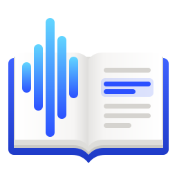
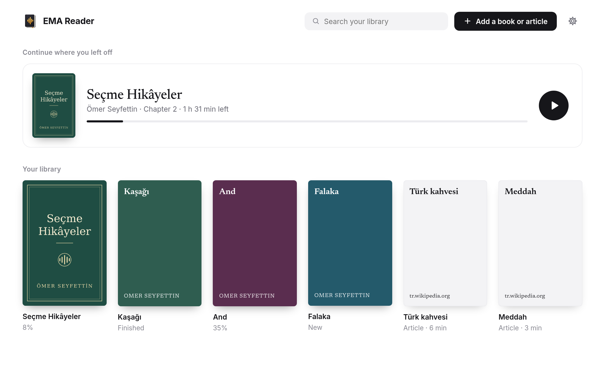
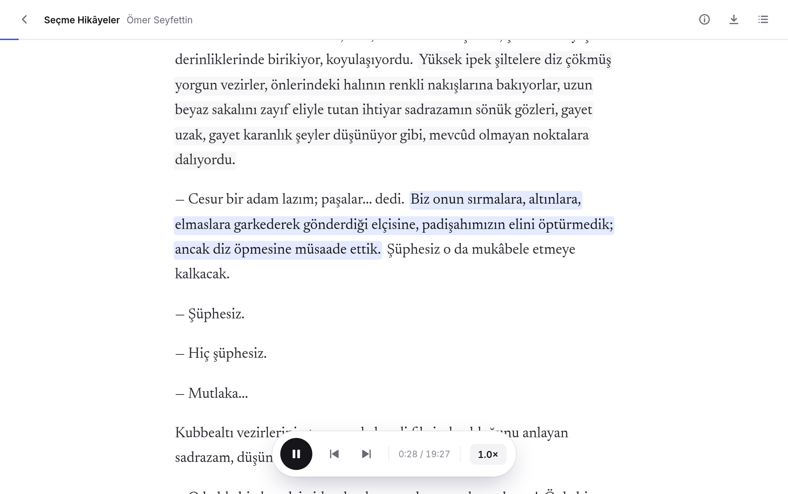
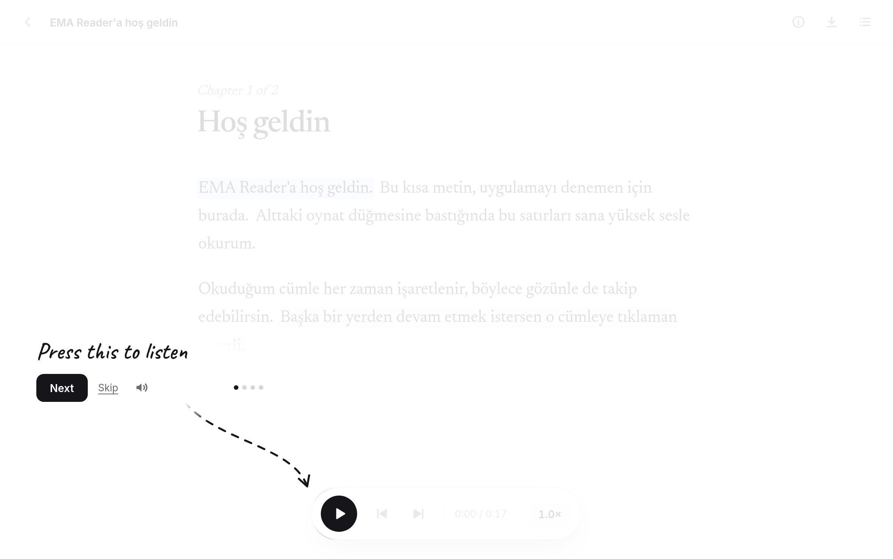
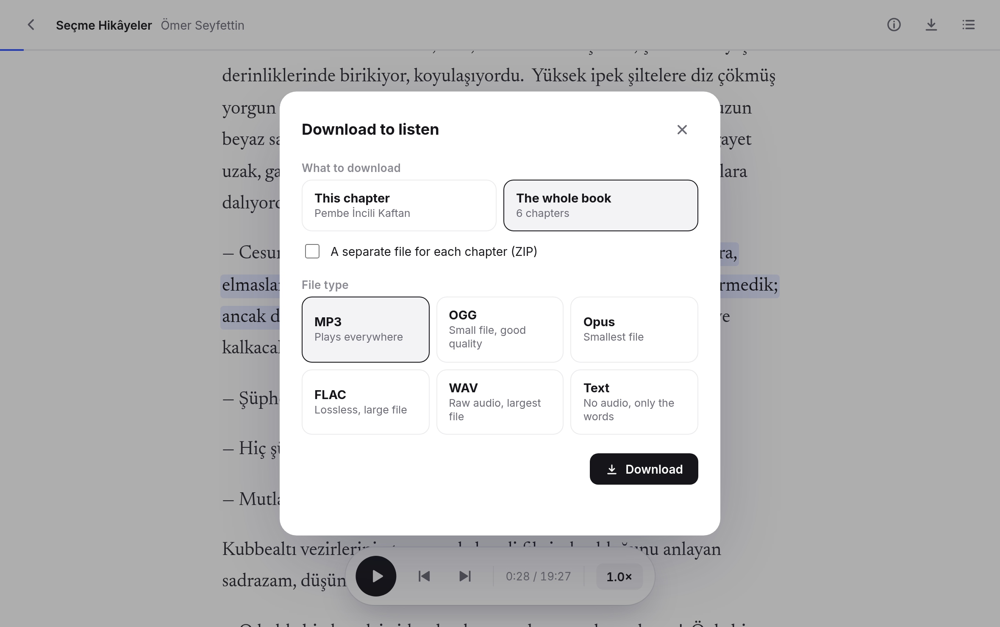
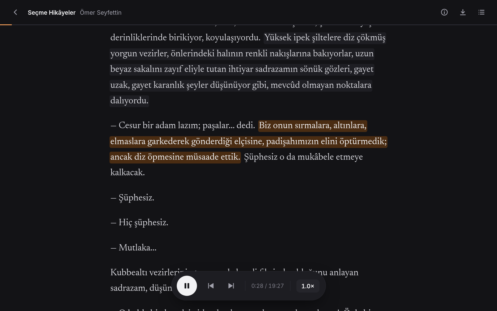

<p align="center"></p>

<h1 align="center">EMA Reader</h1>

<p align="center"><b>Listen to your books and articles in Turkish.</b><br>
Add a book, press play, and EMA Reader reads it to you, on your own computer.</p>



## What it does

- **Reads your books aloud.** Add an EPUB or PDF, or paste the address of an article, and listen.
- **Shows where it is.** The sentence being read is highlighted. Click any other sentence to continue from there.
- **Remembers your place.** Close the app and come back tomorrow; it picks up at the same sentence.
- **Goes at your pace.** Slow it down or speed it up whenever you like.
- **Lets you take it with you.** Save a chapter or a whole book as MP3 for your phone or the car.
- **Stays private.** Everything happens on your computer. No account, no subscription, and nothing you read is sent anywhere.



## Get EMA Reader

**Windows and macOS:** download the installer from the [Releases](../../releases) page and open it.

Because the app is new and free, Windows or macOS may warn you the first time you open it. On Windows choose "More info" and then "Run anyway"; on macOS right-click the app and choose "Open".

**Linux:** install [uv](https://docs.astral.sh/uv/), then:

```bash
git clone https://github.com/sudoeren/ema-reader
cd ema-reader
uv run --extra desktop desktop.py --install
```

After that, EMA Reader is in your applications menu.

## Your first minute

The first time you open EMA Reader, it shows you around. A short welcome text is already there, so you can press play and hear it straight away. The tour is spoken as well, and you can replay it later from Settings.



## Using it

**Add something to listen to.** Choose "Add a book or article", then drop a file onto the window, pick one, or paste a web address.

**Listen.** Press play. Use the two arrows beside it to move a sentence back or forward, and the number on the right to change the speed.

**See what a book is about.** Each book has a details page with its cover, description and table of contents.


**Save it for later.** Download one chapter or the whole book. MP3 plays everywhere; the other choices are there if you want smaller files or higher quality.



**Make it yours.** In Settings you can switch to a dark theme, pick a colour, and make the text bigger.



## Good to know

- EMA Reader has one voice and reads **Turkish only**. Foreign words are read as if they were Turkish.
- A scanned PDF that is only pictures of pages has no text to read.
- The voice is generated by AI. If you share a recording, say so.
- Numbers, dates and abbreviations are read automatically and can occasionally come out wrong.

## For developers

How it works, the HTTP API, the command-line tool and how the installers are built are in [docs/development.md](docs/development.md).

## Credits

Made by [Eren Çakar](https://erencakar.com).

The voice is [EMA Lightning](https://huggingface.co/canberkkkkkk/ema-lightning) by Canberk Aslan. EMA Reader is an independent project and is not affiliated with the model's author.

EMA Reader is open source under the [MIT License](LICENSE). The work it builds on is listed in [THIRD_PARTY.md](THIRD_PARTY.md). The stories in the screenshots are by Ömer Seyfettin and are in the public domain.
